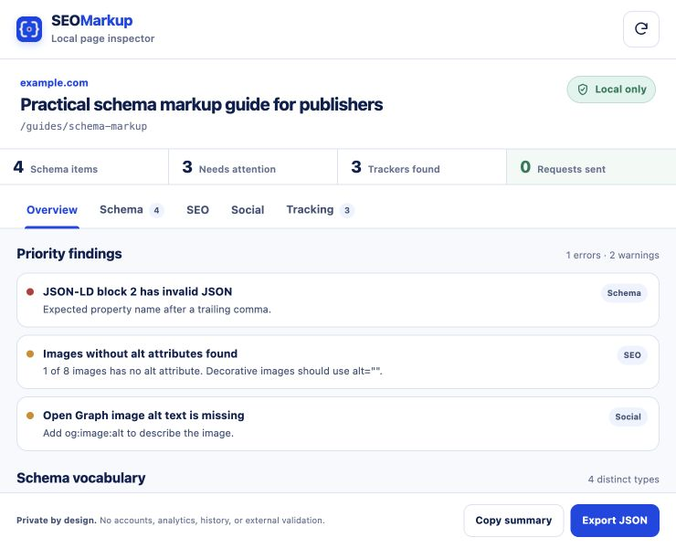
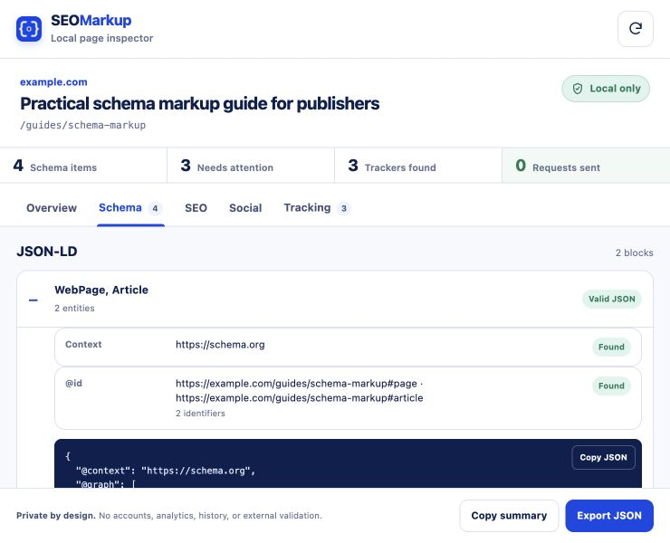
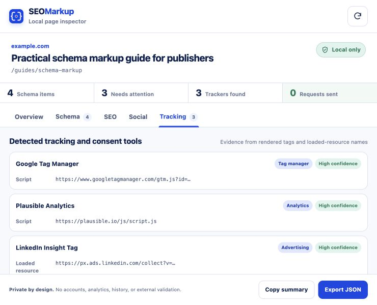

# SEOMarkup Structured Data Schema Inspector

A privacy-focused Chrome extension and browser-based source inspector for Schema.org markup, SEO and social metadata, and common tracking tags.

Public site: [schema.businesspress.io](https://schema.businesspress.io)



The interface separates direct evidence from guidance: parsing failures are errors, fixable omissions are warnings, and non-blocking heuristics remain notes. It deliberately avoids an invented SEO score.

| Structured data detail | Tracking evidence |
| --- | --- |
|  |  |

## What it checks

- JSON-LD syntax, `@context`, `@type`, nested types, `@id`, and duplicate identifiers
- Microdata and RDFa item types and property counts
- Page title, meta description, canonical, robots, viewport, language, headings, image alt coverage, and hreflang
- Google, Facebook, X/Twitter, and LinkedIn previews from declared metadata, including image-alt fields
- Common analytics, advertising, session-replay, consent, and monitoring tags with concrete on-page evidence
- Copyable summaries and user-triggered local JSON exports

SEOMarkup reports what exists in the rendered page. It does not claim search-engine eligibility, fetch remote vocabularies, test URLs, or replace Google Rich Results Test/Search Console.

## Browser URL reports

The landing page accepts one public URL and returns a source-only report in the current browser tab. The endpoint fetches up to 2 MB of HTML, follows only validated public redirects, blocks private/reserved networks and non-standard ports, and does not retain scan history. It does not execute page JavaScript or load unrelated assets. The social-image option is checked by default, so opening the Social tab loads declared images directly from their source with no referrer. Uncheck it before inspection to keep images blocked until you click **Load preview images**.

Each completed report gets a report-specific compressed URL-fragment link. The server neither receives nor stores that fragment, anyone with the link can read it, and restoring it does not fetch the inspected page again. Decoding stops if the report expands beyond 2 MB. Rendered DOM and runtime tracker evidence still require the extension.

## Privacy and permissions

The manifest requests only:

| Permission | Why it is needed |
| --- | --- |
| `activeTab` | Inspect the page only after the toolbar button is clicked |
| `scripting` | Run the bundled local scanner in that active tab |

There are no host permissions, background workers, analytics, accounts, remote analysis APIs, or saved scan history. Declared social preview images load only after an explicit click. See [PRIVACY.md](PRIVACY.md).

## Install locally

1. Open `chrome://extensions`.
2. Enable **Developer mode**.
3. Choose **Load unpacked**.
4. Select this repository's `extension` folder.
5. Pin SEOMarkup and click it on any regular web page.

## Verify and package

```bash
npm run check
npm run package
```

The package command creates both `dist/seomarkup-v0.1.0.zip` and the public download at `public/downloads/seomarkup-v0.1.0.zip`.

## Public site

The site lives in `public/`. The landing page itself can be previewed with a static server, while URL reports require PHP with cURL:

```bash
python3 -m http.server 4174 --directory public
# or
php -S 127.0.0.1:4174 -t public
```

Forge should use the HTML framework, repository root `/`, web directory `/public`, branch `main`, and this zero-downtime deployment script:

```bash
$CREATE_RELEASE()
cd $FORGE_RELEASE_DIRECTORY
$ACTIVATE_RELEASE()
```

The otherwise-static Forge site needs one exact PHP-FPM location for `/api/inspect.php`; all other PHP paths remain blocked. The reviewed snippet is in [`docs/forge-nginx-api-location.conf`](docs/forge-nginx-api-location.conf). Confirm the server's active PHP socket before applying it.

## Current limitations

- The tracker inventory is evidence-based but cannot observe blocked or server-side tags that leave no rendered DOM or Performance API trace.
- Structured-data checks are local structural checks, not Google feature-eligibility validation.
- Chrome-protected pages cannot be inspected.

Copyright (c) BusinessPress. All rights reserved.
